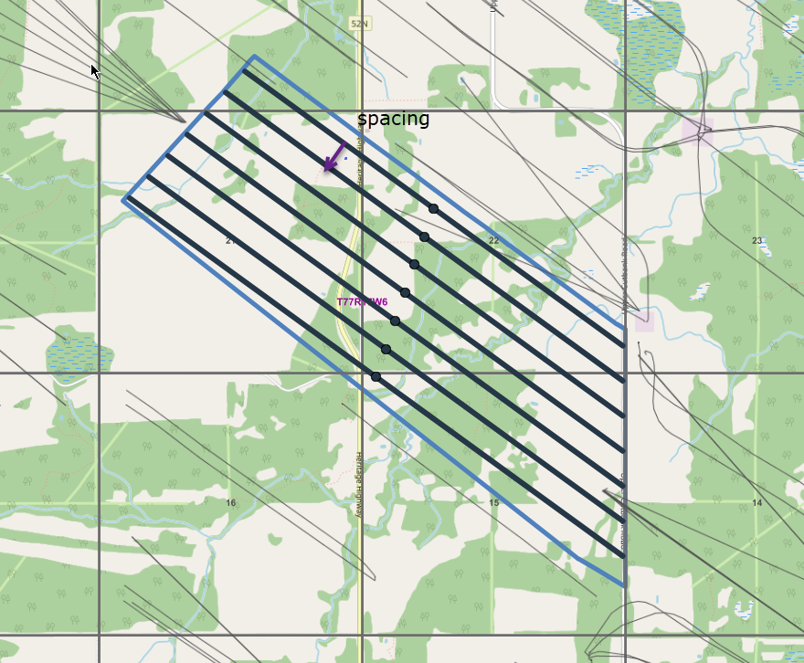
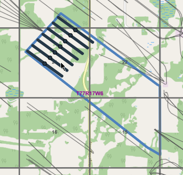
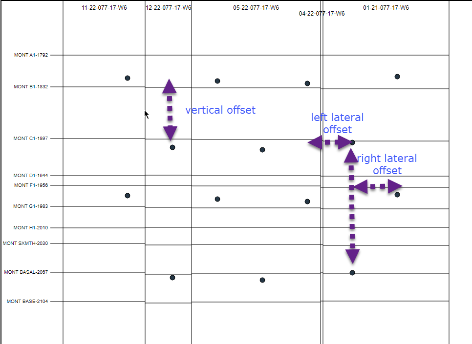

# Turing Backend Programming Exercise #1

## Introduction
You are tasked with creating a program that will generate a pad of horizontal wells within a  specified polygon. The program should generate n number of layers according to a specified input. Each subsequent layer must be offset laterally and vertically by a specified amount, similar to a "wine rack". In addition, the well sticks should be positioned according to an azimuth specified in the input. The wells must fill the entire polygon but cannot go beyond the bounds of the polygon and cannot be longer than the specified max length.

## Inputs:
geometry: **Geojson file path** - the path to the geojson file.  
azimuth: **angle degree** - the direction of the well.  
numberOfLayers: **integer** - number of layers.  
maxLength: **number**  - max length of the well in meters   
spacing: **number** - the spacing between the wells.  
leftLateralOffset: **number** - the left lateral offset between the layers.  
rightLateralOffset: **number** - the right lateral offset between layers.  
layerVerticalOffset: **array of number equal to n-1 layers** - the vertical offset between layers. For example, if we have a 3 layer pad, an input of [100,200] means that layer 1 -> layer 2 should have a vertical spacing of 100m, layer 2 -> layer 3 will have a vertical spacing of 200m.

## Outputs:
The program should output a MultiLineString in WKT (https://en.wikipedia.org/wiki/Well-known_text_representation_of_geometry) containing long (x), lat (y), and depth (z). Eg.

    MULTILINESTRING Z((10 10 1, 20 20 3, 10 40 4),(40 40 4, 30 30 1, 40 20 4, 30 10 4))

## Examples:
   
In the example above, the blue border is the polygon. The pad consists of 4 layers, spacing of 300 meters.

   
The example above shows what should happen when max length is restricted.

  
If you look at the cross section you should be able to see a wine rack like placement where the  layers are spaced 300m apart.
